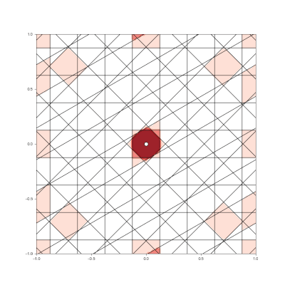

# BrainBlocks Extended Documentation

## Motivation

Although, the existing implementations of HTM algorithms retain neuroplausibility, they are not aimed at solving machine learning problems effectively.
Furthermore, there are many open questions about how to solve many ML problems with HTM-like systems.

We built BrainBlocks with the following goals in mind:

- be able to solve practical ML applications
- be highly scalable
- use it to gain a *computer science* understanding of HTM divorced from the neuroscience

## Gallery

### Online Learning of Multivariate Time-Series Abnormalities

### Comparison of BrainBlocks and Scikit-Learn Classifiers

### Granulated Representation of Space with Hypergrids

## Research Contributions

The work on BrainBlocks has produced a number of useful contributions that are of interest to the HTM community.

### Can Now Solve ML Applications

BrainBlocks uses HTM methods to solve practical ML applications.  In particular, it solves the following problems:

- Multivariate abnormality detection on time-series
- Classification task with a distributed supervising learning module

### Dramatically Increases Scalability

The BrainBlocks implementation lean and uses novel algorithm design to achieve efficient computation.
This allows the creation of much larger networks of components that can be run in a real-time setting.

- Reduced memory footprint by using sub-byte representation of states
- Novel algorithm design is the source of most gains in scalability
- Algorithms implemented in C and running on single core CPU

### Learns Fast

The modules of BrainBlocks that perform learning are much faster and more stable than the baseline HTM implementations.
In most cases, BrainBlocks will learn a pattern with one training sample and will resist catastrophic forgetting when learning new patterns.
This is achieved by treating the "synaptic connections" of HTM as a scarce resource and being deliberate about when and where they are created.

- Achieves one-shot learning
- Resistant to catastrophic forgetting

### Can Encode N-Dimensional Data

A major challenge of using HTM for ML applications was how to encode data with more than a couple dimensions and do it effectively.
By taking the "grid cell" concept and generalizing it into N dimensions, we can now effectively encode feature vectors with arbitrary dimensionality, using a new algorithm called the Hypergrid Transform (HGT).
The curse of dimensionality still exists for HGT encodings, but effective ML results have been seen with N<=40.

- Encode N-dimensional feature vectors to distributed binary patterns
- Generalization of grid cell concept with Hypergrid Transform

### Theory of Distributed Binary Patterns

A major foundation of HTM theory is the Sparse Distributed Representation (SDR), the underlying high dimensional binary vectors.
However, a great deal of HTM processing entails binary vectors that violate the properties of being "distributed" and being "sparse".
Most forms of data encoding fall into this category.
We then must ask, what are the properties of the binary patterns created by different encodings?  How do we know which encodings to choose?
To answer these questions, we have been developing a new theory of Distributed Binary Patterns (DBP), where SDRs are a subset.

- Define DBPs as superset of SDRs, without distributed and sparsity requirements
- Achieve better understanding of how DBPs work
- Understand how information in a DBP is processed

### Identified Unfair Advantages of an HTM-like Approach

A major question that gets asked about HTM is, why should I use it at all?
Why not used Deep Learning?
This question is perfectly valid and there was no good response.
After overcoming the above issues to build a tool that can actually solve ML problems, we feel we can start to answer.

Using the BrainBlocks tool and leveraging the design decisions it has made, we've identified the following advantages:

- Can learn on small data sets
    - Achieves one-shot learning
- Robust to data outside training set
    - Out-of-family detection is built-in
- ML decisions are explainable by applying classifier to internal state
    - Compared to inscrutable Deep Learning networks

## Differences from Vanilla HTM

For those familiar with the individual modules of most HTM implementations, we provide a breakdown of the differences with the BrainBlocks approach, as well as the different terms we use.

### Transformers

BrainBlocks has three different transformers to convert data to DBP representation.
The Scalar Transformer and the Symbol Transformer are the main workhorses of vanilla HTM and are provided by BrainBlocks virtually the same.

BrainBlocks also provides the HyperGrid Transform (HGT), which generalizes the grid cell encoding approach for arbitrary dimensionality.
This is the primary vehicle for encoding data in BrainBlocks.

### Pooler

BrainBlocks' version of the HTM Spatial Pooler (SP) is called the Pattern Pooler (PP).
The main difference between PP and SP are:

- PP does not use boosting but instead uses a learning percentage parameter to create a randomized bitmask when updating receptor permanences

### Sequence Learner

BrainBlocks' version of the HTM Temporal Memory (TM) is called the Pattern Sequence Learning (PSL).
The main differences between PSL and TM are:

* PSL starts with no distal synaptic connections, where TM starts randomly initialized
* PSL creates new synaptic connections, when predictions fail
* PSL treats a column as a reservoir for representing hidden states
* PSL does not use bursting.  Instead, hypothesizes new transitions between existing and novel hidden states in deliberate manner.
* PSL does not require pooling.  An transformer can be connected directly to the input of PSL
* Using PSL for abnormality detection does not require the use of "anomaly likelihood".  Direct output performs well.

### Classifier

BrainBlocks has a new component that vanilla HTM implementations do not have called the Pattern Classifier (PC).
This adds a supervised learning capability to the HTM ecosystem.
The PC is very similar to the PP with the following differences:

* PC associates individual neurons to class labels
* Modulatory label input controls reward/punishment step when neurons activate
* Predicted class can be computed by counting the class membership of each active neuron